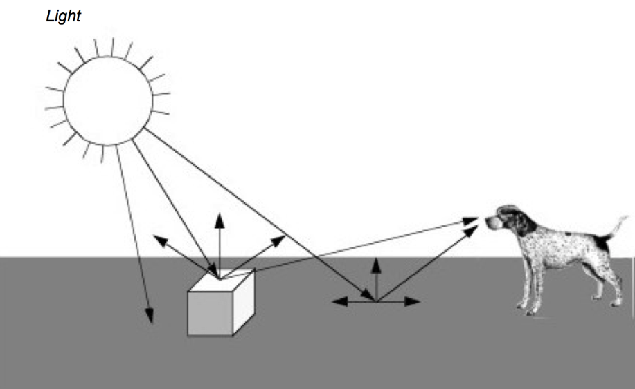

参考链接：https://examples.vtk.org/site/VTKBook/01Chapter1/

# 计算机图形学入门

**计算机**图形学是数据可视化的基础。实际上，可视化是将数据转换为一组图形基元的过程。然后使用计算机图形学的方法将这些图元转换为图片或动画。本章讨论基本的计算机图形学原理。我们首先描述光和物理对象如何相互作用形成我们所看到的东西。接下来我们研究如何使用计算机图形技术来模拟这些交互。

## 3.1 简介[¶](https://examples.vtk.org/site/VTKBook/03Chapter3/#31-introduction)

计算机图形学是使用计算机生成图像的过程。我们称这个过程*为渲染*。渲染过程有多种类型，从 2D 绘画程序到复杂的 3D 技术。在本章中，我们重点关注可视化的基本 3D 技术。

我们可以将渲染视为将图形数据转换为图像的过程。在数据可视化中，我们的目标是将数据转换为图形数据或*图形基元*，然后进行渲染。我们渲染的目标与其说是照片真实感，不如说是信息内容。我们还致力于交互式图形显示，通过它可以直接操作底层数据。本章解释了从图形数据渲染图像的过程。我们首先观察灯光、摄像机和物体（或演员）在我们周围的世界中相互作用的方式。在此基础上，我们解释如何在计算机上模拟这个过程。

如图，展示了当我们观察一个物体（在本例中是一个立方体）时会发生什么的简化视图。光线从光源向各个方向发射。 （在这个例子中，我们假设光源是太阳。）其中一些光线碰巧照射到立方体，立方体的表面吸收了一些入射光并反射了其余的光。一些反射光可能会射向我们并进入我们的眼睛。如果发生这种情况，那么我们就“看到”了该物体。同样，一些来自太阳的光会照射到地面，其中一小部分会反射到我们的眼睛中。

3D 计算机图形学的一种常见且有效的技术称为*光线追踪*或*光线投射*。光线追踪通过跟踪每条光线的路径来模拟光与物体的相互作用。通常，我们从观察者的眼睛向后跟踪光线并进入世界，以确定光线击中的对象。光线的方向是我们正在看的方向（即视图方向），包括透视效果（如果需要）。当光线与物体相交时，我们可以确定该点是否被光源照亮。这是通过追踪从交点到光线的光线来完成的。如果光线与光线相交，则该点被照亮。如果光线在到达光之前与其他物体相交，那么该光将不会有助于照亮该点。对于多个光源，我们只需对每个光源重复此过程。所有光源的总贡献加上任何环境散射光将决定该点的总照明或阴影。通过向后跟踪光线的路径，光线追踪仅查看最终进入观看者眼睛的光线。这极大地减少了模拟程序必须计算的光线数量。

### 图像顺序和对象顺序方法

渲染过程可以分为两类：*图像顺序*和*对象顺序*。光线追踪是一个图像排序过程。它的工作原理是一次确定每束光线发生的情况。对象顺序过程的工作原理是一次渲染一个对象。在上面的示例中，对象顺序技术将首先渲染地面，然后渲染立方体。

从另一个角度来看，可以考虑画一幅谷仓的图画。使用图像顺序算法，您将从画布的左上角开始，滴下一滴正确颜色的颜料。 （每个油漆滴称为一个图片元素或*像素*。）然后您将向右移动一点并放下另一滴油漆。您将继续，直到到达画布的右边缘，然后向下移动一点并开始下一行。每次滴下一滴颜料时，您都要确保画布上每个像素的颜色都是正确的。完成后，您将获得一幅谷仓的画。

另一种方法是基于更自然的（至少对于许多人来说）对象顺序过程。我们的工作方式是在场景中绘制不同的对象，而与对象在场景中的实际位置无关。我们可以从后到前、从前到后或以任意顺序绘画。例如，我们可以从绘制天空开始，然后添加地面。画完这两个物体后，我们将添加谷仓。在图像排序过程中，我们以非常有序的方式在画布上工作；从左到右，从上到下。通过对象顺序过程，我们倾向于从画布的一个部分跳到另一部分，具体取决于我们正在绘制的对象。