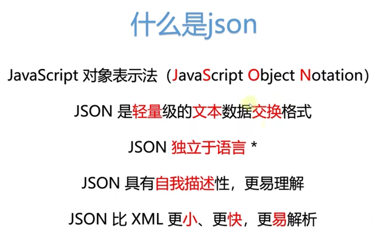
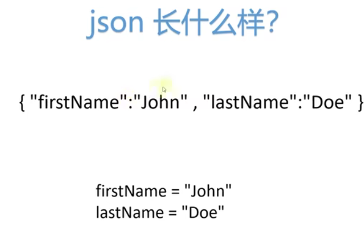
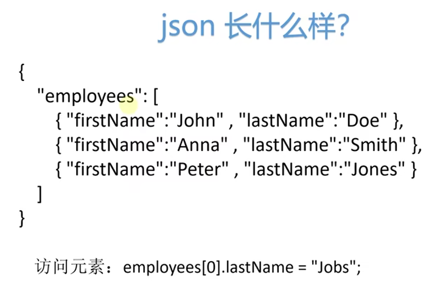
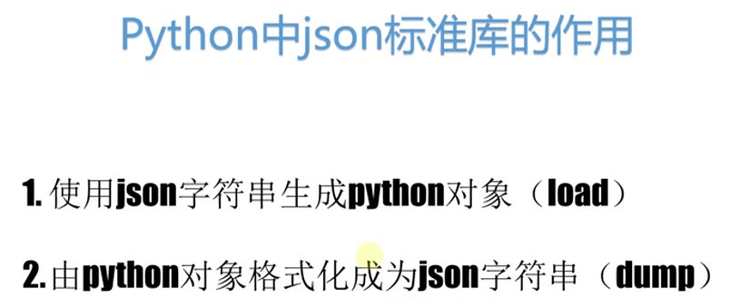
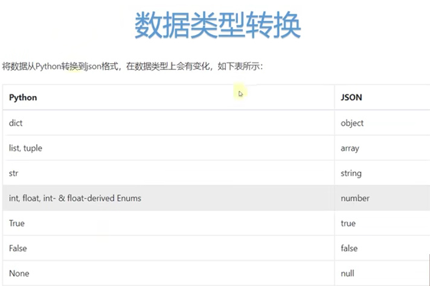
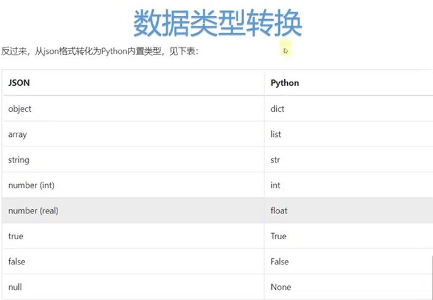
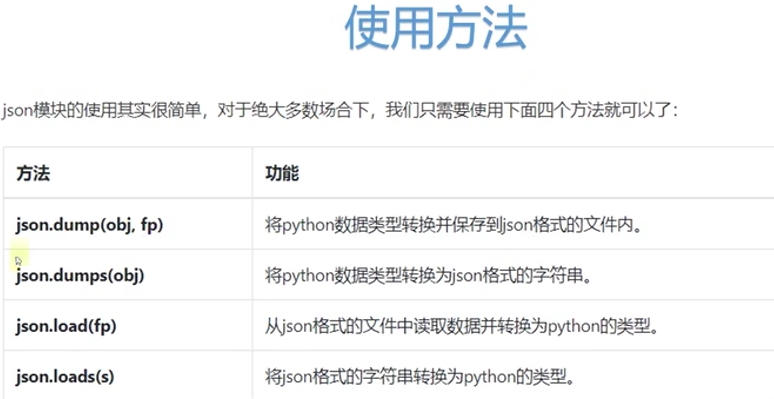

学习视频链接：https://www.bilibili.com/video/BV1Nz4y1Q7w9/?spm_id_from=333.880.my_history.page.click
### 什么是json
json 是 Python 内置的一个标准库，用于处理 JSON 格式的数据。
json 是一种轻量级的数据交换格式，通常用于 Web 应用程序之间的数据传输。
json 模块提供了将 Python 对象序列化为 JSON 字符串和将 JSON 字符串反序列化为 Python 对象的功能。

### json的格式

### json标准库的作用

### 数据类型转换

### 使用方法

