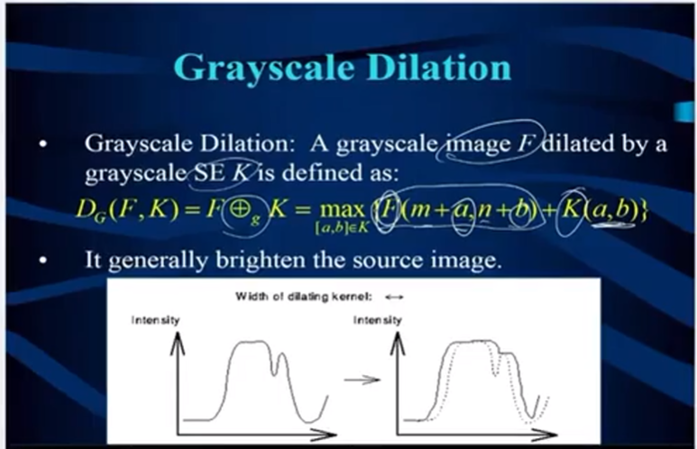

## 处理流程

一、预处理：

1. 增强（Sharpen）：通过锐化图像边缘来提高图像的清晰度和细节。这可以帮助医生更好地分析图像并做出准确的诊断。
2. 平滑（Smooth）：平滑处理可以减少图像中的噪声，使图像更加清晰和易于分析。常见的平滑方法包括均值滤波、高斯滤波等。
3. 插值（Interpolate）：在医学图像处理中，有时候需要对图像进行放大或缩小操作。插值是一种基于已知像素值来推测未知像素值的方法，用于调整图像的尺寸和比例。
4. 减噪（Reduce noise）：医学图像中可能存在各种类型的噪声，如高斯噪声、椒盐噪声等。
5. 裁剪（Crop）：裁剪是指从原始图像中选择感兴趣区域（ROI）并将其提取出来。这可以帮助医生集中注意力分析关键部位，减少无关信息的干扰。

二、Segmentation

ROI（region of interest）是从图像中选择的一个图像区域，这个区域是你的图像分析所关注的重点。圈定该区域以便进行进一步处理。使用ROI圈定你想读的目标，可以减少处理时间，增加精度。

"Group"通常用于表示一组共享相同属性（如来自同一病人、同一模态）的图像.

"Label"通常用于标记和区分图像中的特定区域或对象，如肿瘤、血管、肺部边界等。例如，在图像分割任务中，我们通常会将图像分割成多个区域，每个区域都有一个对应的标签，表示该区域的类型。

三、Recognition

Object Matching/Template Matching是计算机视觉和图像处理中的一个基本问题，主要用于确定图像中的特定对象或场景之间的相似度。如归一化交叉相关或Dice系数。

四、Modeling

Volume Rendering，Deformable Model，Mathematical Model：三维建模，常用技术：VTK。

+++

## 灰度直方图与二值化

一、灰度直方图介绍

灰度直方图是一种用于表示图像中各个灰度级别的频率分布的统计图。在灰度图像中，每个像素的灰度值可以从0（表示黑色）到255（表示白色）。灰度直方图可以告诉我们每个灰度值对应的像素数量，从而反映出图像的亮度分布。

灰度直方图特点： 把整个图像浓缩在直方图中，丢失了所有的空间信息；灰度直方图按照x轴进行积分，就是图像的面积。
灰度直方图应用：

（1）设置图像的参数:
（2）分析图像灰度的变化，确定最优二值化的值：因为灰度直方图通常有一个属性，双峰性（bimodal）（一个称为前景峰值，另一个为背景峰值）。通常两个峰值之间的最小值，为我们想找的最优二值化的分界点。

二、直方图均衡化

直方图是图像的统计学特征。直方图举例：像素值直方图，边缘、方向，梯度直方图等等。
直方图有很多应用：均衡化（增强对比度）、有颜色物体跟踪…

图像直方图均值化都是基于灰度图。直方图均衡化自动调整图像对比度，使图像清晰，是图像增强的一个手段

三、二值化介绍（ 简单、没有前后关联的、基础、有效的图像分割算法。）

二值化是一种常用的图像处理技术，它可以将图像中的每个像素转换为两种可能的值，通常是0和255，这两种值通常代表黑色和白色。二值化的主要目的是简化图像，使其更容易进行进一步的处理和分析。二值化的过程通常涉及到选择一个阈值。如果像素的灰度值大于这个阈值，那么像素的值就被设置为255（白色）；如果像素的灰度值小于这个阈值，那么像素的值就被设置为0（黑色）。选择阈值的方法有很多种，包括固定阈值二值化和自适应阈值（局部阈值）。

## 卷积与滤波

### “edge”（边缘）

图像中的“edge”（边缘）是图像属性中的一种，它指的是图像亮度（或颜色）显著变化的地方。在视觉上，边缘通常对应于物体的轮廓、物体内部的分界线、纹理的变化等。在图像处理和计算机视觉中，边缘检测是一种基本而重要的技术，它用于捕捉图像中的重要特征，为图像分析、物体识别、场景理解等提供基础。

### 边缘检测的原理

边缘检测主要是通过寻找图像亮度快速变化的地方来实现的。这种变化通常表现为图像的梯度较大的区域。图像的梯度是指图像在某一点处亮度变化的最大方向和程度。因此，边缘检测的核心就是计算图像的梯度，并找出梯度值大的那些点。

### 如何求边缘

边缘检测通常通过以下步骤进行：

1. **噪声去除**：由于边缘检测对噪声非常敏感，因此通常首先使用平滑滤波器（如高斯滤波器）去除图像中的噪声。
2. **计算梯度**：使用梯度算子（如Sobel算子、Prewitt算子、Roberts算子、Canny算子等）来计算图像每个像素点的梯度大小和方向。这些算子通过与图像进行卷积来计算水平和垂直方向上的梯度，从而得到梯度的幅度和方向。
3. **非极大值抑制**（仅在一些方法中使用，如Canny边缘检测）：该步骤旨在细化梯度图像中的边缘。通过保留梯度方向上局部最大值点，并抑制其他非最大值点，使边缘更加细致。
4. **阈值处理**：通过设置一个或多个阈值来确定哪些地方的梯度强度足够大，可以被认为是边缘。在Canny边缘检测中，通常采用双阈值策略来识别强边缘、弱边缘和非边缘。

### 常见的边缘检测算子

- **Sobel算子**：通过计算图像在x和y方向上的一阶导数的近似值来检测边缘。
- **Canny算子**：是一种较为复杂的边缘检测算法，它考虑了信噪比和边缘定位精度，能有效控制错误检测。
- **Laplacian算子**：基于二阶导数，寻找零交叉点来检测边缘。
- **Prewitt算子**、**Roberts算子**：也是通过计算图像梯度的方法，但是采用不同的核来实现。

图像噪声降低（Noise Reduction），也称为图像去噪（Denoising），是图像处理中的一个重要环节，目的在于从图像中去除噪声或干扰，以提高图像质量。图像在获取、传输或处理过程中往往会引入各种噪声，如传感器噪声、压缩产生的噪声等，这些噪声会影响图像的视觉效果和后续处理的效果。

### 图像去噪的原理

图像去噪的基本原理是通过某种算法对图像的每个像素值进行调整，使其更接近其原始（无噪声）状态。这通常需要在去除噪声的同时尽可能保留图像的细节和结构信息，这是一项挑战，因为噪声和图像细节在频域中往往是重叠的。

### 如何进行图像去噪

图像去噪的方法很多，可以大致分为时域方法和频域方法两大类。时域方法直接在图像的像素上操作，而频域方法则是在图像的频谱上进行操作。

### 常见的图像去噪算法

1. **均值滤波**：通过将每个像素值设置为其邻域内像素值的平均值来去噪。这是最简单的去噪方法之一，但容易导致图像模糊，损失细节。
2. **中值滤波**：将每个像素值替换为其邻域内像素值的中位数。中值滤波对于去除椒盐噪声（salt-and-pepper noise）特别有效，且能较好地保留边缘。
3. **高斯滤波**：使用高斯函数作为权重对像素的邻域进行加权平均。高斯滤波是一种线性平滑滤波，能有效去除高斯噪声，同时较好地保持图像边缘。
4. **双边滤波**：同时考虑空间邻近度和像素值相似度，能在去噪的同时保护边缘。双边滤波对于保持边缘信息在图像去噪中非常有效。
5. **小波变换去噪**：通过对图像进行小波变换，然后根据噪声的特性对小波系数进行阈值处理，最后进行逆小波变换重构图像。小波去噪能在多尺度下分析图像，更好地平衡细节保持与去噪之间的关系。
6. **非局部均值去噪**（Non-Local Means Denoising）：考虑图像中重复的纹理和结构，通过对整个图像搜索相似的区块进行加权平均来去噪。这种方法在保持图像结构方面表现出色。

## 图像的基本操作和特征

### 点操作（point operation）：

点操作，又称为像素级操作，是指那些在单个像素上独立进行的操作。这类操作不考虑像素周围的上下文信息。点操作的典型例子包括：

### 代数操作（algebraic operation）：

这些操作涉及到对两个或多个图像进行数学运算，以便合成新的图像或提取有用信息。代数操作通常是基于像素的，意味着对图像中对应像素的数值进行计算。下面我们来详细探讨几种常见的代数操作。

1.图像加法

图像加法是将两个图像的对应像素值相加。这可以用于多种目的，如图像融合、噪声增加（用于测试）等。假设有两个图像A和B，结果图像C的每个像素 (C(x, y) = A(x, y) + B(x, y))。需要注意的是，在进行加法操作时可能会出现像素值溢出的情况（超过255），因此可能需要进行归一化或截断处理。

2. 图像减法

图像减法是从一个图像中减去另一个图像的对应像素值，通常用于背景减除、图像差异分析等。如果有两个图像A和B，结果图像C的每个像素 (C(x, y) = A(x, y) - B(x, y))。同样，减法操作后可能需要对结果进行调整，以确保所有像素值都在有效范围内（例如0到255）。

3. 图像乘法

图像乘法涉及到将两个图像的对应像素值相乘。这种操作可以用于图像掩模（masking）、调整图像亮度等。对于图像A和B，结果图像C的每个像素 (C(x, y) = A(x, y) * dot B(x, y))。乘法操作后，可能需要对结果进行缩放，以保持像素值在合理范围内。

4. 图像除法

图像除法是通过将一个图像的像素值除以另一个图像的对应像素值来完成的。这可以用于创建特殊效果或进行某些类型的图像恢复。对于图像A和B，结果图像C的每个像素 (C(x, y) = A(x, y) / B(x, y))，当然，需要注意避免除以零的情况。

###  集合操作（geometric operation）

1. 平移（Translation）

平移操作会将图像中的每个像素移动到一个新的位置，通常由水平偏移量（dx）和垂直偏移量（dy）来定义。在平移操作中，图像的形状和大小保持不变。

[x' = x + t_x] 

[y' = y + t_y]

2. 旋转（Rotation）

旋转操作会围绕一个旋转中心将图像中的像素旋转一个特定的角度。旋转操作可能导致图像的一部分超出原始图像的边界，因此可能需要对结果图像进行裁剪或填充。

[x' = x \cos(\theta) - y \sin(\theta)] 

[y' = x \sin(\theta) + y \cos(\theta)]

3. 缩放（Scaling）

缩放操作会改变图像的尺寸，可以是等比例缩放或非等比例缩放。等比例缩放会保持图像的纵横比，而非等比例缩放则可能会导致图像被拉伸或压缩。

4. 镜像（Mirroring）

镜像操作会沿着水平轴或垂直轴翻转图像，产生图像的镜像副本。这种操作在某些图像处理任务中很有用，例如在数据增强阶段生成更多的训练数据。

5. 仿射变换（Affine Transformation）

仿射变换是一种更复杂的几何变换，它可以通过组合多个简单的变换（如平移、旋转、缩放和倾斜）来实现。仿射变换保持了图像中线条的平行性，是一种线性变换加上平移。

6. 透视变换（Perspective Transformation）

透视变换是一种更高级的几何变换，它可以模拟相机视角的变化，如从一个角度查看物体时的视觉效果。透视变换可以创建或校正图像中的透视效果，使得图像看起来更加真实或符合特定的视觉需求。

应用示例

- **图像校正**：通过几何操作，可以校正图像中的畸变，如摄像头畸变、透视畸变等。
- **图像配准**：在将两个或多个图像叠加在一起进行比较或融合时，几何变换用于图像配准，确保图像正确对齐。
- **数据增强**：在机器学习和深度学习领域，通过对训练图像应用几何变换（如旋转、缩放、镜像），可以增加数据集的多样性，帮助提高模型的泛化能力。

### 插值算法(interpolation algorithm)

插值算法（Interpolation algorithms）在图像处理中扮演着非常重要的角色，特别是在进行图像缩放、旋转、透视变换等几何操作时，我们需要重新计算变换后图像像素点的值。插值算法就是用来估计这些新像素位置的颜色值的方法。以下是几种常见的插值算法：

1. 最近邻插值（Nearest Neighbor Interpolation）

最近邻插值是最简单的插值方法之一。它将目标图像中的每个像素值设置为源图像中最近像素的值。这种方法的优点在于计算速度快，但缺点是图像质量可能不是很高，尤其是在放大操作时，图像可能会出现明显的锯齿状边缘。

2. 双线性插值（Bilinear Interpolation）

双线性插值考虑了像素周围的四个最近的像素点，并基于距离进行加权平均，以此来计算目标像素的值。这种方法比最近邻插值提供了更平滑的图像效果，但计算量也相对较大。双线性插值在处理图像放大和缩小时是一个很好的折中方案，能够保持较好的图像质量。

3. 双三次插值（Bicubic Interpolation）

双三次插值是一种更为复杂的插值方法，它考虑了目标像素周围的16个像素（4x4邻域），并使用三次多项式来进行插值。这种方法通常能够产生比双线性插值更平滑、更自然的图像，特别是在图像放大时。然而，双三次插值的计算成本也更高。

4. Lanczos插值

Lanczos插值使用sinc函数的窗口化版本作为插值核心。这种方法在保留细节方面表现得非常好，尤其适合于图像缩放操作。Lanczos插值可以提供接近或超过双三次插值的图像质量，同时保持较高的计算效率。Lanczos插值的一个关键参数是“a”，它决定了使用多大的邻域进行计算，常见的选择是Lanczos-2或Lanczos-3。

5. 插值算法的选择

选择哪种插值算法取决于具体的应用需求。如果对图像质量的要求很高，并且可以接受较长的计算时间，双三次插值或Lanczos插值是很好的选择。如果需要快速处理图像，而对图像质量的要求相对较低，最近邻插值或双线性插值可能更合适。在实际应用中，还会考虑到其他因素，如内存使用、实现复杂度等。

### 邻域操作(neighbourhood operation)

邻域操作（Neighborhood Operations），也被称为局部操作或区域操作，是图像处理中的一种基本操作，它涉及到对图像中每个像素及其周围邻域内的像素进行处理。这类操作根据像素及其邻近像素的值来计算新的像素值，常用于图像滤波、边缘检测、特征增强等任务。以下是一些基本的邻域操作示例：

1. 平滑（Smoothing）或模糊（Blurring）

平滑操作通过减少图像中的强度变化（即噪声或细节）来使图像变得更加平滑。常见的平滑技术包括均值滤波、高斯滤波等。

- **均值滤波**：使用一个简单的滑动窗口（通常是正方形），将窗口内所有像素的平均值作为中心像素的新值。
- **高斯滤波**：使用一个基于高斯函数形状的权重窗口，对邻域内的像素进行加权平均。权重随着距离中心像素的距离增加而减小。

2. 锐化（Sharpening）

锐化操作旨在增强图像的边缘和细节，使图像看起来更清晰。这通常通过增强图像中的高频成分来实现。一个简单的锐化方法是使用拉普拉斯滤波器，它可以突出显示区域的快速变化。

3. 边缘检测（Edge Detection）

边缘检测是一种特殊的邻域操作，旨在识别图像中对象的边界。常用的边缘检测算法包括Sobel、Prewitt和Canny边缘检测器。这些方法通过计算图像中像素强度的梯度来识别边缘。

4. 邻域操作的一般步骤

1. **定义邻域大小**：选择一个窗口（邻域），它可以是3x3、5x5或其他大小，取决于具体应用。
2. **窗口滑动**：将窗口从图像的一个角开始，逐步滑动至整个图像，处理每一个像素点。
3. **计算新像素值**：根据特定的算法（如平均、加权平均、最大值、最小值等），使用窗口内的像素值计算当前位置像素的新值。
4. **边界处理**：对于图像边缘的像素，其邻域可能部分在图像外。这时，需要一种策略来处理这些情况，如扩展边缘像素、镜像、忽略等。

5. 注意事项

- 邻域操作通常会导致图像尺寸的变化，特别是在边缘处，因此在实际应用中需要考虑如何处理边界问题。
- 在执行邻域操作时，特别是在进行滤波时，可能会造成图像的某些特征（如边缘）的模糊，因此需要根据具体需求选择合适的操作和参数。

### 连通区域标记（Connected Component Labeling）

连通区域标记（Connected Component Labeling）是图像处理中的一种算法，用于识别图像中的连通区域，并为每个独立的连通区域分配一个唯一的标签。这个过程通常应用于二值图像，即图像被分为前景和背景两部分。连通区域标记的目的是识别所有属于同一对象的前景像素，并将它们归为同一组或区域。

1. 基本概念

- 连通区域

  ：在二值图像中，前景像素按一定的连接性准则（如4-连通或8-连通）相互连接形成的集合。

  - **4-连通**：如果两个像素在水平或垂直方向上相邻，则认为它们是连接的。
  - **8-连通**：如果两个像素在水平、垂直或对角线方向上相邻，则认为它们是连接的。

2. 算法步骤

连通区域标记算法的一般步骤如下：

(1)**初始化**：遍历图像的每个像素，为每个前景像素分配一个临时标签（通常从左上角开始遍历）。

(2)**扫描图像**：

- 在第一次扫描过程中，检查每个前景像素的邻域（根据4-连通或8-连通规则）。
- 如果邻域内没有已标记的像素，为当前像素分配一个新的标签。
- 如果邻域内有一个或多个已标记的像素，选择其中一个标签（最小的标签）应用于当前像素，并记录所有找到的标签之间的等价关系。

(3)**解析等价关系**：处理所有标签的等价关系，确保所有属于同一连通区域的像素拥有相同的最终标签。

(4)**第二次扫描**：再次遍历图像，根据等价关系表更新每个像素的标签，以确保所有属于同一连通区域的像素具有相同的唯一标签。

3. 应用

连通区域标记在图像分析中非常有用，常见的应用包括：

- 物体检测和计数：通过标记和分析连通区域，可以识别并计数图像中的物体数量。
- 形状分析：对每个连通区域进行进一步的几何和拓扑分析，提取形状特征。
- 图像分割：将图像分割成有意义的部分，为进一步的图像处理或分析提供基础。

### 区域属性（Region Properties）

区域属性（Region Properties）是指从图像的连通区域（或分割后的区域）中提取的特征，这些特征可以用来描述区域的几何形状、大小、位置、纹理等方面的信息。区域属性在图像分析、模式识别、计算机视觉等领域有着广泛的应用，比如物体识别、分类和追踪。以下是一些常见的区域属性：

1. 几何属性

- **面积**：区域内像素的总数。
- **周长**：区域边界的长度。对于数字图像，可以通过计算边界上的像素点数来近似表示。
- **质心（Centroid）**：区域的几何中心，可以通过对区域内所有像素的坐标求平均值得到。
- **边界矩形（Bounding Box）**：完全包含区域的最小矩形。
- **极性（Eccentricity）**：区域形状的椭圆度，描述区域形状接近于圆形还是线条形。
- **方向（Orientation）**：区域的主轴方向，反映了区域的伸展方向。
- **紧密度（Compactness）**：区域面积与其周长的比率，用于描述区域的形状复杂度。
- Bounding box：

2. 纹理属性

纹理属性描述了区域内像素值分布的规律性和复杂性，常用于区分具有不同表面特征的对象。

- **对比度（Contrast）**：反映了图像纹理中最亮和最暗区域之间的差异。
- **均匀性（Uniformity）**：当图像的局部非常一致时，均匀性值增加。
- **熵（Entropy）**：反映了图像纹理的复杂度，熵值越高，纹理越复杂。

3. 拓扑属性

拓扑属性描述了区域的连接性和孔洞的数量等特征。

- **欧拉数（Euler Number）**：区域中对象的数量减去孔洞的数量。

计算方法

区域属性的计算通常遵循以下步骤：

1. **图像预处理**：包括噪声去除、二值化等，以便更好地识别区域。
2. **区域标记**：使用连通区域标记算法识别并标记图像中的独立区域。
3. **属性计算**：对每个标记的区域，根据需要计算各种几何、纹理和拓扑属性。

应用

区域属性的提取对于许多图像处理和计算机视觉任务至关重要，包括：

- **物体检测和识别**：通过比较区域属性来识别图像中的特定物体。
- **图像分割**：基于区域属性对图像进行分割，将图像划分为具有相似特征的区域。
- **图像分类**：利用区域属性作为特征向量进行图像内容的分类。

## VTK与ITK

VTK（Visualization Toolkit）和ITK（Insight Segmentation and Registration Toolkit）是两个广泛用于医学图像处理和可视化的开源库，它们在功能上互补，在许多医学图像分析项目中同时被使用。尽管它们有共同的使用场景，但它们各自专注于不同的领域。

**VTK - Visualization Toolkit**

VTK是一个跨平台的开源库，主要用于3D计算机图形学、图像处理以及可视化。它支持多种编程语言，包括C++、Python、Java等。VTK提供了广泛的数据结构和算法，用于创建复杂的3D图形和图像可视化应用程序。VTK适用于科学研究、工程分析、数据可视化等领域。

VTK的特点包括：

- 支持多种2D和3D图像格式。
- 提供了丰富的3D模型渲染和动画制作功能。
- 包含高级算法，如体积渲染、表面重建、流场可视化等。
- 支持交互式和非交互式应用程序的开发。
- 强大的数据处理和可视化能力，可以处理来自不同领域（如流体动力学、分子生物学等）的数据。

**ITK - Insight Segmentation and Registration Toolkit**

ITK是专门为图像分割（Segmentation）和图像配准（Registration）设计的开源库。它广泛应用于医学图像处理领域，尤其是在处理CT、MRI等医学成像数据时。ITK使用C++编写，并提供了对Python的绑定，使得它既可以支持高性能的算法实现，也便于快速原型开发和测试。

ITK的特点包括：

- 强大的图像分割和配准算法，支持多种医学图像格式。
- 提供了广泛的图像滤波器、变换和分析工具。
- 高度模块化的设计，易于扩展和集成。
- 支持多线程，优化了算法的执行效率。
- 社区活跃，文档丰富，有大量的教程和示例代码。

## 二值的形态学

数字形态学（Digital Morphology）是图像处理和计算机视觉领域的一个重要分支，主要关注于图像的形状分析。它通过应用一系列基于形状的操作来分析和处理几何结构，特别是二值图像和灰度图像。数字形态学的操作基于集合论，使用数学形态学元素（称为结构元素）来量化和提取图像特征。

### 基本操作

数字形态学的基础操作主要包括膨胀（Dilation）、腐蚀（Erosion）、开运算（Opening）和闭运算（Closing）。

1. **膨胀（Dilation）**
   - 膨胀操作使图像中的物体边界向外扩展，可以用来填补物体内的小孔或连接邻近的物体。
   - 在二值图像中，如果结构元素与图像的交集非空，该位置的像素被设置为前景。、
   - 
   - 
2. **腐蚀（Erosion）**
   - 腐蚀操作使图像中的物体边界收缩，可以用来消除小物体或分离相邻的物体。
   - 在二值图像中，只有当结构元素完全包含在图像的某个部分时，该部分的中心像素才保持为前景。
   - 
   - 
3. **开运算（Opening）**
   - 开运算是先腐蚀后膨胀的过程，用于移除小物体、平滑较大物体的边界，而不明显改变其面积。
   - 开运算对消除小物体和分离物体的粘连非常有效。
   
   
   
4. **闭运算（Closing）**
   
   - 闭运算是先膨胀后腐蚀的过程，用于填充物体内的小孔和小裂缝，同时保持物体的主要形状。
   - 闭运算对填充物体中的小孔和连接近邻物体非常有效。

### 算法

1.**Hit and Miss**

前景通常指的是图像中感兴趣的对象或者区域，而背景则指的是不重要的或不相关的部分。在二值图像中，前景通常由像素值为1（或最大值）的部分组成，而背景则由像素值为0的部分组成。Hit and Miss需要击中前景与错过背景。

Hit-and-Miss算法是一种在图像处理中广泛使用的算法，特别是在二值图像中检测特定模式时非常有用。它通过使用一个结构元素（SE），该元素包含1、0和空白（表示“不关心”位置）来滑动二值图像。如果模板与图像匹配，算法将中心对应的像素设置为1，否则设置为0。这种方法特别适用于在二值图像中识别角点、端点、轮廓点和孤立像素。

Hit-and-Miss算法涉及两个腐蚀操作，其中两个不同的SE，k1和k2，被定义。这些SE必须是不相交的（它们的交集为空），并且是一个更大SE，K的子集。第一个腐蚀操作使用k1在原始图像上，第二个腐蚀操作使用k2在反转图像（F^c，其中F是原始图像）上。最终结果是通过取这两个腐蚀结果的交集得到的。这个过程允许从图像中提取特定特征，如孤立像素、端点和轮廓点。

2.**Pattern Spectrum模式谱**

模式谱（Pattern Spectrum）算法是一种数学形态学工具，用于描述和分析图像中对象的形状大小分布。模式谱通常借助开操作（opening）和闭操作（closing）的连续应用来获得，而这些操作都使用一系列逐步增长的结构化元素。

模式谱能够反映出图像中特征的粗细程度，并将其整理为一系列大小频率，这有助于识别和分类不同的形态学结构。简单来说，模式谱衡量的是在不同尺度上前景对象的分布情况。

3.**递归膨胀（Recursive Dilation）和递归腐蚀（Recursive Erosion）**

**递归膨胀** 是指连续进行多次膨胀操作，每次膨胀都是在前一次膨胀操作的基础上进行的。这种操作可以帮助连接图像中断开的部分，比如连接断开的线条或填补孔洞。由于膨胀会趋向于扩大图像中的对象，递归膨胀可以使图像中的小物体或细节消失，同时保留或加强较大的结构。

**递归腐蚀** 是指连续进行多次腐蚀操作，每次腐蚀都在前一次操作的基础上。腐蚀操作的目的是缩小或移除图像中的物体边缘，常用于消除小的噪点或断开连接的物体。在多次递归腐蚀之后，只有较大的图像结构才能保持不变，小结构会逐渐腐蚀掉。

由于递归操作是重复的，结果会以幂级数变化。换言之，每次操作都会显著放大或减少特征，可以通过选择合适的结构元件和迭代次数来控制此变化。

4.**距离变换（Distance Transform）**

距离变换（Distance Transform）是图像处理中的一种操作，它计算了每个图像中前景像素（通常是二值图像中的白色像素）到最近的背景像素（通常是黑色像素）的距离。这个操作有很多种算法实现，最常用的包括欧几里德距离（Euclidean Distance），城市街区距离（City Block Distance）以及棋盘距离（Chessboard Distance）。

5.**Skeletonization**

骨架化（Skeletonization）是一种图像处理技术，旨在从二值图像中提取一个对象的最细干（单像素宽度）集合，这些最细干要尽可能地保留原始形状的所有连接性和总体几何特征。这个过程通常涉及迭代地应用形态学腐蚀和开运算，直到得到细化的骨架。

### 应用

## 灰度形态学操作

### Dilation(膨胀)

效果：被dark regions包围的bright regions得到增大，而被bright regions包围的dark regions缩小。

### Erosion（）

## 重采样（Resampling）

以下以SimpleITK为例

Origin：具有所有零索引的体素在世界坐标系中的位置

Spacing：沿每个维度的像素之间的距离,对应的是`numpy`上的维度。super-sampling(上采样)：将spacing减小；sub-sampling（下采样），将spacing增大。

Size：每个维度中的像素数。

    1.	SimpleITK: image[x,y,z]   x,y,z对应三维矩阵的列标、行标、深度，对应到图片上为图片宽度、高度、深度
    2.	Numpy: image_numpy_array[z,y,x]  x,y,z对应矩阵的深度、高度、宽度，对应到图片上为图像的深度、高度、宽度
    二者坐标恰好相反
Direcation（方向余弦矩阵）：对应于矩阵列的每个轴的方向

## 配准（Registration）

图像配准（Image Registration）是一种常用于图像处理领域的技术，其目标是在同一场景或场景下多个图像之间找到对应关系。这项技术广泛应用于医学成像、遥感、计算机视觉以及其他需要图像对齐的领域。

在图像配准中，`移动图像`（Moving Image）通常指需要被变换或对齐的图像，而`固定图像`（Fixed Image）则指作为参考的目标图像。图像配准的过程就是要通过某种变换将移动图像对齐到固定图像的坐标空间上。

图像配准可以分为刚性配准（僅包括旋转和平移）、仿射配准（旋转、平移、缩放和剪切）和非刚性配准（也称为弹性配准，允许图像变形）等几种类型。

### 框架

Interpalator（插值器）:用于在给定数据点集中估算未知位置的数值。在图像处理中，这通常意味着根据已知像素的颜色和位置来推算新像素位置上的颜色值。插值算法如最近邻插值、线性插值、双线性插值等，被广泛应用于图像缩放、旋转、放大等操作中，以保持图像质量和准确性。

Metric（度量）:用来评估两张图像之间配准的准确性或质量的数值。如dice

Optimizer:优化器

Transform:转化矩阵

### 图像配准方法

1.**基于特征点（Landmark-based）的图像配准**:在这种方法中，选取源图像和目标图像中的一些显著特征点（称为特征点或landmarks）来引导配准过程。这些特征点通常是图像中能够明确识别的点，比如角点、边缘的交叉点、或者图像内的解剖标记点。

2.**基于表面（Surface-based）的图像配准方法**:是专门用于处理图像中的表面或容积数据。求取两个表面的最近距离的最小误差。如"Head and Hat"算法。

3.**基于体素强度（Voxel Intensity-based）方法**:是一种直接利用图像强度信息来对齐图像的方法。它不依赖于特征提取或者对象表面的确定，而是基于假设配准的图像区域在强度分布上应该有相似性。这种方法主要用于灰度图像，当灰度直方图是y=x一条直线时最好。

4.**基于信息论（Information Theory-based）的方法**:用于图像处理和分析领域，依托的是通信和概率统计中的信息论概念。信息论在图像分析中主要用于度量和分析图像内容的不确定性和信息量。需要用到**熵（Entropy）**、**互信息（Mutual Information, MI）**等。

### 刚性配准（Rigid Registration）

1.**基本信息**

- 仅仅包括旋转和平移两种变换，保持图像的尺寸和形状不变。
- 刚性配准不会改变图像内物体的几何结构，因此适用于仅需根据物体的整体位置和方向进行调整的场合。

translation（平移）- in X, Y & Z direction

rotation（旋转）- about X, Y & Z axes

2.**矩阵介绍**：配准（Registration）时使用的变换矩阵通常是4行4列，这是因为它代表了一种齐次坐标表示法，用于执行线性变换如平移、旋转、缩放，以及透视变换等。`齐次坐标（Homogeneous Coordinates）`的主要好处是能够使用矩阵乘法来表示多种几何变换。齐次坐标系统通过增加一个额外的维度（通常是第四维度w）来实现这一点，以简化变换的表示和计算。最后一行`0 0 0 1`用于保持齐次坐标的一致性，使得四维点 (x, y, z, 1) 经过变换后仍然保持其齐次形式。

3.**医学图像transform过程**：将fixed-image和moving-image映射(mapping)到世界坐标系上，然后计算出转换和逆转换transform矩阵。

4.**评估指标（Metrics）**:

- Intra-modal(同一模态下)：

Mean squared difference(minimise)：差值均方根

Normalised cross correction(maximise)：互相关

Entropy of difference(minimise)：熵差

- Inter-model(异模态)：

Mutual information(maximise)：互信息

Normalized mutual information(maximise)

Entropy correaltion coefficient(maximise)：熵间相关性

AIR cost function(minimise)：AIR（Automated Image Registration）成本函数

5.**优化算法**

- Gradient Descent:梯度下降
- Regular step Gradient descent:规定步长的梯度下降（掉头步长/2）
- Conjugate Gradient:共轭梯度

### **非刚性配准（Non-rigid Registration）**

- 包括仿射变换之外的更高级变换，如弯曲，允许图像局部区域以不同的量进行移动和缩放。
- 非刚性配准通常用于考虑组织形态变化或在不同时刻下的医学影像配准，它允许图像进行更复杂的变形以适应目标图像的形状和结构。

局部发生剧烈形变的情况下使用

1.工作原理：

- Thin Plate Spline（薄板样条，TPS）算法是一种常用的非刚性配准方法，它可以平滑地将一组点映射到另一组点。TPS 模型的核心思想是模拟一个薄板被外力作用后发生的弯曲。假设有源点集与目标点集，TPS 能找到一个最小弯曲能量的映射函数，用来对源点集进行变换，使其尽可能接近目标点集。
- cubic B-splines:考虑周围点的影响形成一个权重，更常用。

2.评估指标

- 均方误差 (MSE)
- 标准化互相关(NCC)
- 联合直方图(Joint Histogram)
- 归一化互信息（Normalized Mutual Information，NMI）
- 互信息测度(Mutual Information)

### 仿射配准（Affine Registration）：

- 包括旋转、平移、缩放和扭曲等变换。
- 对图像进行仿射变换会改变图像的尺寸、比例和形状，但是保持直线为直线，平行线仍保持平行，有助于调整图像的角度和尺度。

刚性和仿射配准通常适用于全体结构变换，而非刚性配准则适用于适应个体的局部变化。选择哪种配准方法取决于具体应用所涉及的图像特性以及期望保持和改变的图像属性。

### 多分辨率配准框架（Multi-resolution registration framework）

一种常用于图像配准的技术，特别是在处理较大的图像和需要计算复杂度较高的非刚体配准时。多分辨率配准方法的基本思想是从粗到细逐步精确寻找最优的配准。

将原始图像通过降采样创建不同分辨率的图像序列，形成一个金字塔结构。顶层是分辨率最低（最粗）的图像，而底层是原始分辨率（最细）的图像。将从低分辨率层获取的配准结果作为启动参数，逐步上升到高分辨率层，每一层都对这些参数继续优化，直到达到最终原始分辨率的层。

优点：

- 提高算法的收敛性，能够更好地避免陷入局部最优。
- 提高配准的速度，因为在低分辨率层上的运算量远小于在原始图像上的运算量。
- 能够处理在高分辨率层上难以观察到的大范围变形。

指标：

定性配准误差（Qualitative registration error）是指通过观察和评估图像配准结果的方式来估计误差，而不是通过定量的数值指标。这种评价方法依赖于视觉检查，并且常用于进行初步的配准效果评估或在缺乏确切地标数据的情况下使用。

## 参考链接

[Orientation and Voxel-Order Terminology: RAS, LAS, LPI, RPI, XYZ and All That (grahamwideman.com)](http://www.grahamwideman.com/gw/brain/orientation/orientterms.htm)

https://simpleitk.readthedocs.io/en/master/gettingStarted.html

