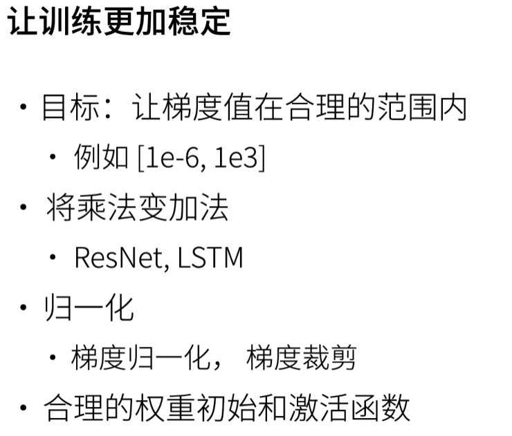
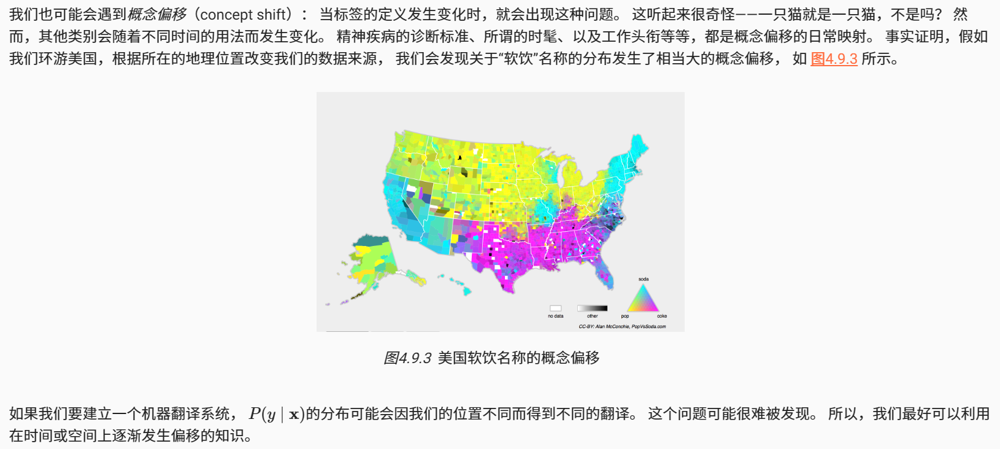
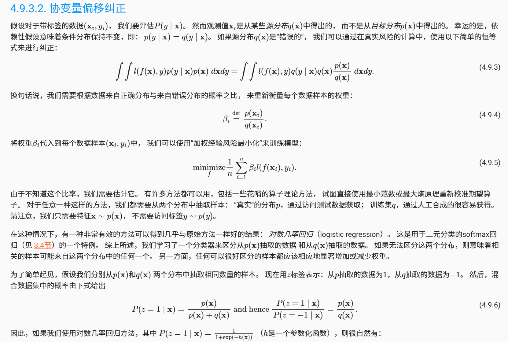
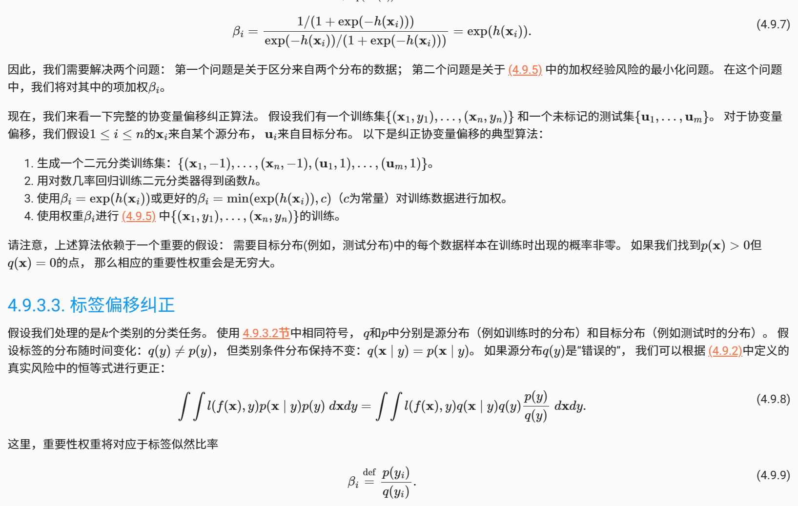
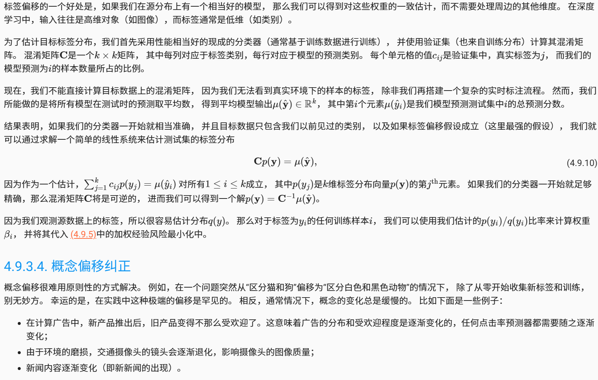

# 机器学习与深度学习

## 训练稳定

### 如何选择激活函数

1. Sigmoid函数（Logistic函数）：
   - 范围在0到1之间，将输入映射到概率的区间。
   - 函数平滑，但存在梯度饱和问题，导致梯度消失。
   - 在输出层用于二分类问题。
2. Tanh函数（双曲正切函数）：
   - 范围在-1到1之间，对输入进行标准化。
   - 和Sigmoid函数类似，但范围更广，具有更好的非线性表示能力。
   - 可用于隐藏层，特别是在RNN中。
3. ReLU函数（线性整流函数）：
   - 对于正数，输出等于输入；对于负数，输出为0。
   - 计算速度快，不存在梯度饱和问题（最经常用）。
   - 但存在“神经元死亡”问题，即某些神经元可能永远不会被激活。
4. Leaky ReLU函数：
   - 在负数部分引入一个小的斜率，以解决ReLU的“神经元死亡”问题。
   - 适用于大规模的深度学习模型。
5. ELU函数（指数线性单元）：
   - 在负数部分引入一个指数函数，以解决ReLU的问题。
   - 对于正数，输出等于输入；对于负数，输出接近于0。
   - 具有平滑性，但计算代价较高。
6. Softmax函数：
   - 用于多分类问题，在输出层将多个神经元的输出转化为概率分布。
   - 将输入值归一化为0到1之间的概率。

### 梯度消失和梯度爆炸（LOSS为NAN/INF）

#### 梯度消失：

梯度消失问题发生在深度神经网络中梯度逐层传播时，梯度值逐渐趋近于零，导致靠近输入层的层接收到的梯度非常小，从而无法有效更新其权重。这个问题的几个可能原因包括：

1. 使用了饱和激活函数：例如 Sigmoid 或 Tanh 函数，在其激活值接近饱和区（即非常大或非常小的值）时，它们的导数接近于零。
2. 权重初始化不当：如果初始权重过小，那么在梯度反向传播时，会造成连乘效应，梯度随着层数增加而急剧减小。
3. 深层网络结构：网络越深，梯度消失的问题就越凸显。这是因为反向传播时梯度需要通过多层的链式法则计算，乘积项过多容易使梯度变小。
4. 

#### 梯度爆炸：

相对应地，梯度爆炸是指在深度神经网络中传递的梯度值逐渐变得非常大，以至于更新权重时会导致权重变得非常非常大，从而使得模型变得不稳定甚至无法继续学习。梯度爆炸的原因可能包括：

1. 使用了饱和激活函数：与梯度消失相反，如果初始权重过大，且激活函数的导数值大于1，则在多层的连乘过程中梯度会不断放大。
2. 权重初始化不当：如果初始权重设置得过大，同样会导致梯度在反向传播过程中逐层放大。
3. 不适当的网络架构设计：某些网络结构设计可能会导致梯度累积过快，从而引发梯度爆炸。

#### 为了缓解这些问题，工程师和研究人员设计了一些策略，包括：

- 使用 ReLU 或者 Leaky ReLU 等激活函数来减少梯度消失问题。
- 使用合适的权重初始化策略（如 He 初始化或 Xavier 初始化）。
- 使用梯度剪切（Gradient Clipping）来处理梯度爆炸。
- 梯度归一化（Gradient Norm Scaling）是深度学习中用来控制梯度爆炸的一种技术。这种技术可以使梯度的大小保持在特定阈值以内。
- 引入短连接（如在残差网络中）来减轻梯度消失和爆炸问题。

#### 其它

- 脏数据：训练数据(包括label)中有无异常值(nan, inf等);
- 除0问题。这里实际上有两种可能，一种是被除数的值是无穷大，即 Nan，另一种就是0作为了除数`（分母可以加一个eps=1e-8）`。
- 可能0或者负数作为自然对数，或者 网络中有无开根号(torch.sqrt), 保证根号下>=0

## 过拟合和欠拟合

### 过拟合

过拟合常见的原因包括：

- 模型过于复杂：模型有过多的参数，它有能力捕捉数据中的每一个小的特征，包括噪声。
- 训练时间过长：模型在训练数据上训练了过多的轮次（Epochs），导致它记住了数据的特异性。
- 数据量不足：可用于训练的数据量太小，模型无法泛化到新样本。

为避免过拟合，可以采用以下策略：

- 交叉验证（Cross-Validation）
- 早停（Early Stopping）：在验证集上的性能不再提升时停止训练。
- 正则化（Regularization）：如 L1、L2 或 Dropout 等技术，给损失函数加上额外的限制项。
- 数据增强（Data Augmentation）：通过变化训练集中的样本来增加数据多样性。
- 简化模型结构：降低模型的复杂度。

### 欠拟合

欠拟合可能的原因包括：

- 模型太简单：缺乏足够的参数来捕捉数据中的复杂性和模式。
- 特征处理不当：可能未能选取足够或者合适的特征来训练模型。
- 训练不足：模型在训练数据上的训练次数太少。

为解决欠拟合，可以采取如下措施：

- 增加模型的复杂度，例如使用更多的层或更多的参数。
- 特征工程：引入更多或更好的特征描述。
- 训练更长的时间，以便使模型学习到更多的数据特征。
- 优化模型的结构或者超参数调优。

## 环境和分布偏移(模型部署)

### 分布偏移类型

#### 协变量偏移

#### 标签偏移

*标签偏移*（label shift）描述了与协变量偏移相反的问题。 这里我们假设标签边缘概率P(y)可以改变， 但是类别条件分布P(x∣y)在不同的领域之间保持不变。 当我们认为y导致x时，标签偏移是一个合理的假设。 例如，预测患者的疾病，我们可能根据症状来判断， 即使疾病的相对流行率随着时间的推移而变化。 标签偏移在这里是恰当的假设，因为疾病会引起症状。 在另一些情况下，标签偏移和协变量偏移假设可以同时成立。 例如，当标签是确定的，即使y导致x，协变量偏移假设也会得到满足。 有趣的是，在这些情况下，使用基于标签偏移假设的方法通常是有利的。 这是因为这些方法倾向于包含看起来像标签（通常是低维）的对象， 而不是像输入（通常是高维的）对象。

#### 概念偏移

### 分布偏移示例

#### 非平稳分布

当分布变化缓慢并且模型没有得到充分更新时，就会出现更微妙的情况： *非平稳分布*（nonstationary distribution）。 以下是一些典型例子：

- 训练一个计算广告模型，但却没有经常更新（例如，一个2009年训练的模型不知道一个叫iPad的不知名新设备刚刚上市）；
- 建立一个垃圾邮件过滤器，它能很好地检测到所有垃圾邮件。但是，垃圾邮件发送者们变得聪明起来，制造出新的信息，看起来不像我们以前见过的任何垃圾邮件；
- 建立一个产品推荐系统，它在整个冬天都有效，但圣诞节过后很久还会继续推荐圣诞帽。

#### 更多轶事

- 建立一个人脸检测器，它在所有基准测试中都能很好地工作，但是它在测试数据上失败了：有问题的例子是人脸充满了整个图像的特写镜头（训练集中没有这样的数据）。
- 为美国市场建立了一个网络搜索引擎，并希望将其部署到英国。
- 通过在一个大的数据集来训练图像分类器，其中每一个大类的数量在数据集近乎是平均的，比如1000个类别，每个类别由1000个图像表示。但是将该系统部署到真实世界中，照片的实际标签分布显然是不均匀的。

### 分布偏移纠正

在这种情况下，我们可以使用与训练网络相同的方法，使其适应数据的变化。 换言之，我们使用新数据更新现有的网络权重，而不是从头开始训练。
